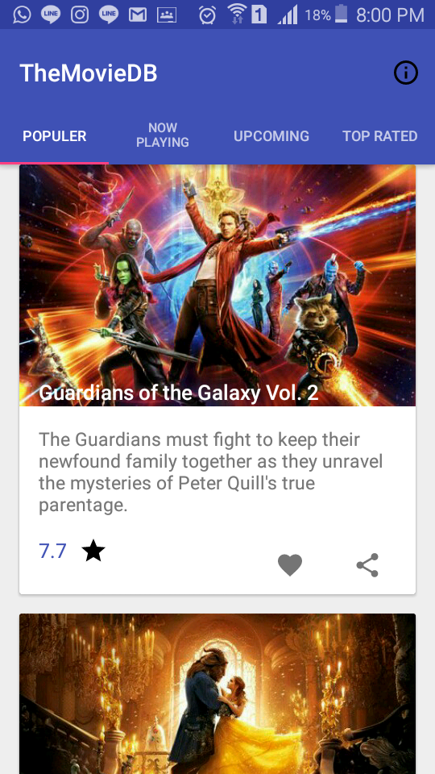
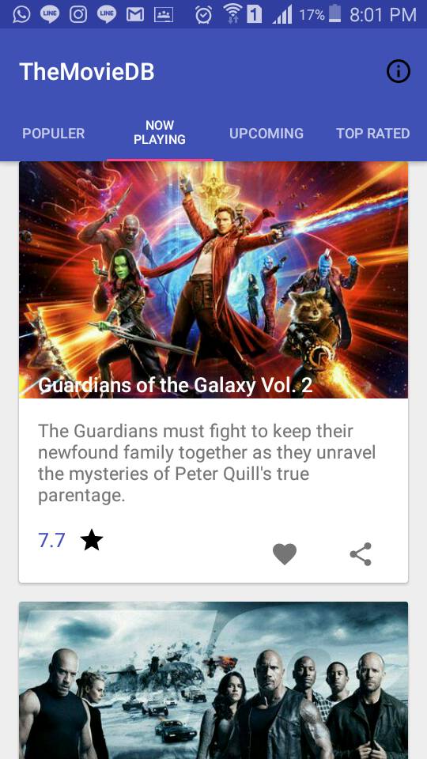
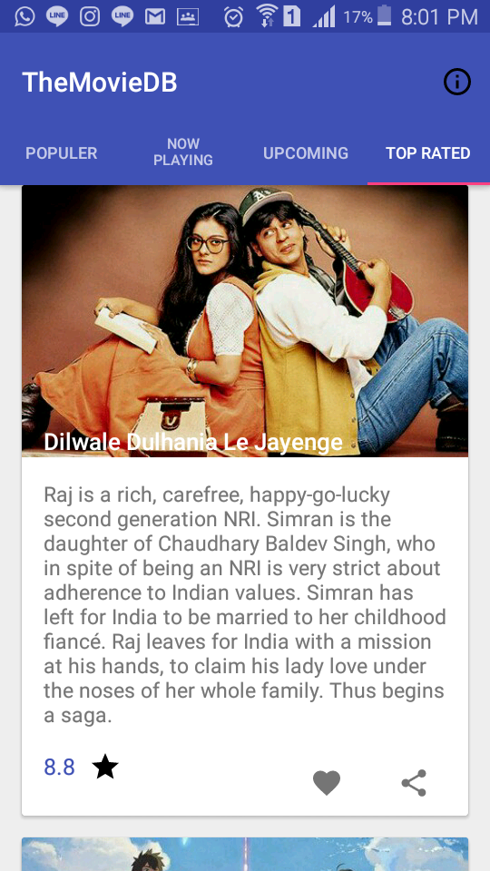
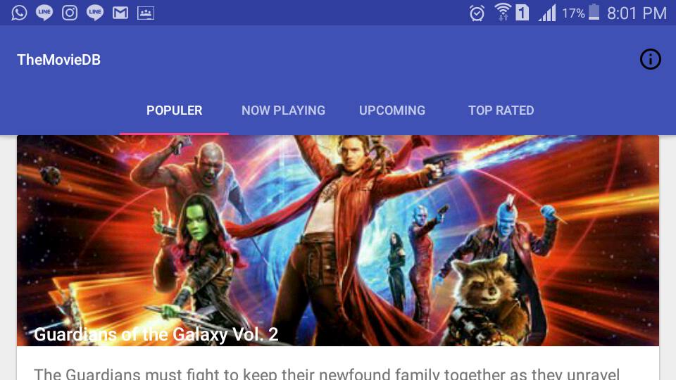
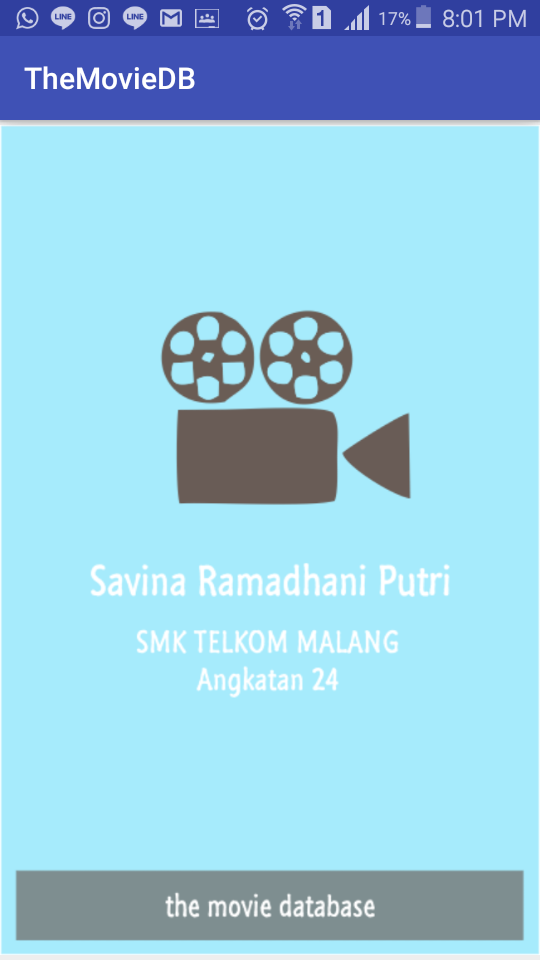

# TheMovieDB

Link File APK release : https://drive.google.com/file/d/0B395MV81wHBURl9sMHMxeHROcUk/view?usp=sharing

Nama Lengkap : Savina Ramadhani Putri T

Kelas / No Urut : XIRPL3 / 31

NIS : 4828/1547/070

Angkatan : 24

Nama Sekolah : SMK Telkom Malang

# Tentang The Movie Database 

API yang digunakan : https://www.themoviedb.org/

Navigasi yang digunakan : Navigasi Tabs

Deskripsi : Aplikasi Android yang memungkinkan Anda melihat film terpopuler, tayang sekarang, yang akan tayang dan paling atas, dan Anda dapat membaca plot dan ulasan film.

Kelebihan Aplikasi :

- User Interface yang menarik bagi pengguna

- Memungkinkan pengguna untuk rotate screen tanpa takut tampilannya akan kacau

Library yang digunakan : SQLite Dasar

# Screenshoot Hasil Aplikasi

Screenshoot1 - Saat aplikasi pertama dibuka, maka akan muncul tampilan seperti dibawah ini :

Screenshoot2 - Ada beberapa menu yang anda bisa pilih, mulai dari Populer, Now Playing, UpComing, dan Top Rated. Dibawah ini tampilan menu Now Playing :

Screenshoot3 - Tampilan dari menu Top Rated :

Screenshoot4 - Tidak perlu khawatir, pengguna juga dapat rotate screen semaunya

Screenshoot5 - About / Informasi

